# HUFF Native wgpu — Full Development Retrospective

**Build reviewed:** `0.21.0 / HNW-21`  
**Roadmap:** Milestones 01–21 complete  
**Document type:** Architecture, migration, milestone, product, and testing retrospective  
**Primary audience:** The project owner, future maintainers, collaborators, local AI systems, and anyone deciding what belongs in the full study branch versus a streamlined production branch  
**Source baseline:** Original Tauri v1 + p5.js HUFF archive and the completed Milestone 21 native-wgpu archive  
**Honesty rule:** “Integrated” means present in the codebase. It does not automatically mean every platform, codec, device, receiver, long session, or extreme setting has been fully certified.

---

## Executive retrospective

HUFF began as a highly effective browser-rendered video instrument packaged inside Tauri. Its immediacy came from p5.js, Canvas2D, direct DOM controls, a persistent graphics buffer, and a two-window arrangement. That design was artistically productive, but the browser owned nearly everything important: the draw loop, pixels, history, feedback memory, timing, and the final canvas. Native Syphon and Spout output therefore required reading the canvas back to the CPU, sending raw frames through a local WebSocket, and uploading them again on the platform side. Source state and control state were also distributed among DOM elements, JavaScript objects, WebSocket roles, and Rust bridges.

The native migration did not merely translate JavaScript into Rust. It changed the **ownership model** of the application:

- Rust now owns canonical state.
- wgpu owns the authoritative image and persistent GPU resources.
- FFmpeg and camera workers own media acquisition under explicit source rules.
- The HTML interface acts as a control surface rather than the renderer.
- Recording and export receive the native Program image.
- Presets, automation, mappings, routing, verification, and interoperability reports speak through typed schemas.

The finished roadmap produces a far more capable system: native temporal memory, a complete GPU effect graph, Syphon and Spout output, live recording, deterministic rendering, production codecs, automation replay, full-resolution export, controller mapping, formal state documents, constrained pipeline recipes, runtime verification, and an honest interoperability research boundary.

The cost is equally real. The native codebase is larger and more specialized. GPU state, media workers, persistent temporal stores, platform bridges, export graphs, and schemas create more places where subtle bugs can hide. Some later features are intentionally provisional or research-oriented. The next phase should therefore **not** add broad new architecture immediately. It should convert the completed roadmap into a measured, calibrated, pruned, and release-ready instrument.

---

## The development graph

The roadmap naturally divided into six phases:

1. **Native substrate — 01–03:** establish ownership, media stability, and GPU history.
2. **Rebuild the visual instrument — 04–07:** restore the flying framebuffer, clusters, scanlines, and complete effect graph.
3. **Output and deliverables — 08–12:** connect HUFF to other software and create live, still, and deterministic production output.
4. **Repeatable production — 13–15:** queue jobs, replay automation, and render the complete graph at export resolution.
5. **Formalize the instrument — 16–19:** preserve the legacy contract, map controllers, define state documents, and expose named buses and recipes.
6. **Observe and prepare — 20–21:** make production health visible, recover safely, and define the future lower-copy transport boundary.

A scalable Mermaid version is included below for Obsidian and other Markdown systems:

```mermaid
flowchart TD
    A[01 Native foundation] --> B[02 Source ownership and stability]
    B --> C[03 GPU temporal history]
    C --> D[04 Historical glitch and flying framebuffer]
    D --> E[05 Cluster bodies]
    E --> F[06 Scanlines and layer priority]
    F --> G[07 Complete core render graph]
    G --> H[08 Syphon and Spout]
    H --> I[09 Live CFR recording]
    I --> J[10 High-resolution stills]
    J --> K[11 Deterministic video export]
    K --> L[12 Production formats and image sequences]
    L --> M[13 Durable export queue — provisional]
    M --> N[14 Deterministic automation replay]
    N --> O[15 True export-resolution graph — refinement pending]
    O --> P[16 Legacy parameter contract and parity lab]
    P --> Q[17 MIDI and OSC mapping]
    Q --> R[18 Presets, snapshots, sequences, projects]
    R --> S[19 Named buses and pipeline recipes]
    S --> T[20 Production verification and recovery]
    T --> U[21 Lower-copy interoperability research]
    U --> V[Testing, calibration, pruning, packaging, release]
```

---

## Architecture migration at a glance

### Original HUFF

The original application used Tauri v1 as a desktop shell around a p5.js/Canvas2D instrument. The controls window contained the draw loop and queried DOM controls directly. A separate canvas window received JPEG frames through a localhost WebSocket. Temporal history lived in browser `ImageData`; feedback lived in `gBuf`; Syphon and Spout used `canvas.getImageData()`, a magic-prefixed WebSocket frame, Rust interception, and a platform texture upload.

### Native HUFF

The current application uses Tauri v2 for the shell and control surface, while Rust and wgpu own the render window, source textures, temporal history, persistent buffers, effect passes, final Program texture, recording, and export. The interface sends commands into a canonical parameter/action model. Syphon and Spout receive bounded asynchronous readbacks from the native Program texture. State, mapping, routing, production verification, and interoperability are described with explicit JSON schemas.

### What was preserved

- Two-window instrument identity: controls plus a dedicated output.
- The original parameter vocabulary and 87-control contract.
- The flying-framebuffer concept.
- Historical glitch tiles, clusters, scanlines, Flow, Smoosh, keying, feedback, and clean-video relationships.
- MIDI, OSC, Syphon, Spout, presets, and live performance orientation.
- The principle that HUFF is an instrument, not merely a file converter or generic node editor.

### What fundamentally changed

| Concern | Original system | Native system |
|---|---|---|
| Authoritative renderer | p5.js / Canvas2D in WebView | Rust + wgpu + WGSL |
| App shell | Tauri v1 | Tauri v2 |
| Live state | DOM values queried by draw loop | Canonical Rust parameter and action state |
| Temporal history | Browser `ImageData` ring | GPU texture-array ring |
| Persistent image memory | Browser `gBuf` | Native persistent GPU targets |
| Draw order | JavaScript call order | Explicit render graph and routing vocabulary |
| Output window | JPEG WebSocket mirror | Native wgpu surface |
| Platform sharing | Canvas readback → WebSocket → upload | Native GPU readback → bounded worker → upload |
| Recording | Browser/live capture model | Native constant-frame-rate recorder |
| Offline video | Not deterministic | Fixed-frame private render clock |
| High-resolution output | Canvas-oriented | Private export-resolution graph |
| Presets/projects | Local and loosely typed | Scoped typed state documents |
| MIDI/OSC | Device/layout-oriented bridges | Canonical learnable mappings |
| Routing | Hidden fixed pipeline | Named buses and constrained recipes |
| Diagnostics | Scattered status and logs | Production and interop report schemas |

---

## Scale of the migration

A rough source count, excluding the bundled p5 library, generated artifacts, Git metadata, and the large third-party Spout SDK, illustrates the change in responsibility:

| Archive | Approximate nonblank core source lines | Main ownership |
|---|---:|---|
| Original Tauri v1/p5 HUFF | ~6,900 | JavaScript/HTML render and UI, small Rust relay/bridges |
| Milestone 21 native HUFF | ~29,100 | ~22,900 Rust, plus HTML/JS control surface, WGSL, and Objective-C camera glue |

The number is not a quality score. It explains why the native system can own more capabilities—and why it now requires stronger boundaries, testing, diagnostics, and documentation. The current native core is divided across roughly 29 Rust source modules, two WGSL shaders, one Objective-C camera bridge, one main frontend JavaScript file, and one main control HTML file.

---

## The current system in ordinary language

### The control surface

The HTML window is the dashboard. It displays sliders, buttons, routing choices, state tools, export controls, diagnostics, and research panels. It should be thought of as a remote control for the engine, not as the place where pixels are produced.

### The canonical state

Rust keeps the official value of every parameter and action. This matters because the UI, MIDI, OSC, presets, automation, projects, export, and routing must agree on the same state. At Milestone 21 there are 100 canonical parameters, including the 87 preserved legacy controls.

### Media ownership

Only one primary source is authoritative at a time. Video decoding, camera capture, source audio, microphone audio, transport, and recovery are supervised native systems rather than side effects of HTML media elements.

### GPU temporal memory

HUFF does not only process the current frame. It keeps recent frames, a flying effect buffer, feedback targets, Flow state, and other persistent resources. Those memories are explicit GPU objects with allocation, reset, update, and health behavior.

### The render graph

The renderer produces clean source textures, samples history, stamps glitch tiles, advances clusters, draws scanlines, combines Smoosh layers, performs keying and Global Mix, runs Flow and feedback, and writes the final Program image. Milestone 19 names the responsibilities without exposing an unrestricted graph.

### Program and Monitor

**Program** is the committed image consumed by recording, export, Syphon, and Spout. **Monitor** is what the local output window inspects. They can be different—for example, Program can remain the final HUFF composite while Monitor shows the raw Field Store.

### Live recording versus offline export

- **Live recording** captures the performance as it happens and keeps a constant output frame rate.
- **Offline export** owns a fixed timeline and renders every frame deterministically, even when the computer takes longer than real time.

### Typed documents

The system now distinguishes:

- a **Preset**: a scoped artistic condition;
- a **Snapshot**: a broad machine-state capture;
- a **Sequence**: timed automation and actions;
- a **Project**: selected state, source references, mappings, and automation;
- a **Route plan**: named buses and legal pipeline choices;
- a **Production report**: runtime health and recovery context;
- an **Interop report**: current transfer path and future lower-copy candidates.

---

# Complete milestone retrospective

## Milestone 01 — Native Engine Foundation

**In ordinary language.** HUFF stopped being primarily a browser sketch inside a desktop shell and became a real native video engine. The HTML interface remained, but it became the control surface rather than the place where the final image was created.

**Technical core.** Introduced the Rust-owned wgpu device, native render window, media and camera foundations, canonical parameter state, transport plumbing, presets, undo, MIDI/OSC entry points, diagnostics, and the control-window/output-window division.

**Why it matters.** Every later feature could share one authoritative GPU and state system instead of adding more browser workarounds.

**Current caveat.** This was infrastructure, not visual parity. The first goal was a stable native substrate rather than a finished instrument.
## Milestone 02 — Source Ownership and Runtime Stability

**In ordinary language.** HUFF learned which source was truly in control. Starting the camera no longer left a video decoding invisibly, and loading a video no longer depended on stale camera frames.

**Technical core.** Made camera and video mutually authoritative, retained file position across source changes, paused inactive audio/decoders, paced surface timeout and occlusion recovery, cleared stale source frames, and corrected redundant decoder starts. Milestone 02.1 records the major corrective pass.

**Why it matters.** Source switching became understandable, less wasteful, and less likely to create “the transport says it is playing but the picture is stuck” behavior.

**Current caveat.** Device-specific camera and permission behavior still requires real-machine testing.
## Milestone 03 — Native GPU Temporal History

**In ordinary language.** Recent frames moved out of JavaScript memory and into a bounded stack of textures on the GPU. This gave HUFF fast access to the past without asking the browser to hold and copy every image.

**Technical core.** Added a texture-array history ring, capture pacing, history diagnostics, and first temporal-depth sampling. Milestones 03.1 and 03.2 corrected bind-group portability and module registration.

**Why it matters.** Historical glitching, frame delays, feedback, and deterministic export could be built on a reusable native temporal-memory system.

**Current caveat.** The initial full-frame temporal preview was only a validation step and was replaced by tile-based sampling in Milestone 04.
## Milestone 04 — Historical Glitch and Flying Framebuffer

**In ordinary language.** The defining HUFF image behavior returned: pieces of older frames are stamped into a persistent image that can fly, drift, rotate, scale, fade, and keep influencing what comes next.

**Technical core.** Added instanced historical tiles, a bounded instance buffer, deterministic tile generation, and a persistent effect buffer. Milestone 04.1 corrected the initial generic-overlay interpretation and restored the original gBuf-style destination-out decay and transform model.

**Why it matters.** This changed the native port from a generic glitch effect into something recognizably HUFF-like.

**Current caveat.** Exact visual parity still depends on later calibration of noise, timing, color, and parameter response.
## Milestone 05 — Cluster Tile Bodies

**In ordinary language.** Glitch tiles gained moving group behavior instead of appearing as unrelated random rectangles. Clusters can travel, steer, breathe, wrap, bounce, spread, and retain momentum.

**Technical core.** Added persistent cluster centers, relative tile constellations, velocity, inertia, noise drift, speed variance, pulse kicks, coherence, bias, spread, spatial gaps, and Bounce/Wrap behavior while reusing the existing glitch instance buffer.

**Why it matters.** Clusters became an instrument with personality and continuity rather than a one-frame distribution option.

**Current caveat.** Motion feel remains a calibration topic; persistence also makes reset behavior and source changes important.
## Milestone 06 — Scanlines and Layer Priority

**In ordinary language.** Scanlines returned, and HUFF stopped relying on accidental drawing order to decide whether glitch or scanline material appears on top.

**Technical core.** Added a native scan-band pipeline and explicit Scan, Glitch, Neutral, and Pulse priority behavior using bounded GPU resources.

**Why it matters.** Layer order became an intentional creative choice and prepared the renderer for Flow, Smoosh, keying, and routing decisions.

**Current caveat.** This milestone intentionally isolated scanline behavior before the larger render graph was assembled.
## Milestone 07 — Complete Core Render Graph

**In ordinary language.** The major HUFF effect families were finally connected into one known order. Glitch, scanlines, feedback, clean video, Flow, Smoosh, Luma Key, and Global Mix could interact in the same native renderer.

**Technical core.** Added sixteen Canvas-style Smoosh blend modes, Luma Key, Global Mix insertion choices, Flow target routing and pulse behavior, and explicit compositing stages. Milestone 07.1 removed a Metal read/write alias hazard; 07.2 added bounded FFmpeg reader threads and watchdog restarts.

**Why it matters.** The native port became a complete working image instrument instead of a sequence of isolated GPU demonstrations.

**Current caveat.** The growing render graph increased interaction complexity and made diagnostics, routing vocabulary, and long-session tests essential.
## Milestone 08 — Native Syphon and Spout Output

**In ordinary language.** The native image could be sent to other visual applications. On macOS this means Syphon; on Windows it means Spout.

**Technical core.** Added bounded asynchronous GPU readback, shared CPU RGBA frames, platform sender workers, and Windows adapter/ownership hardening in 08.1.

**Why it matters.** HUFF can participate in VJ, projection, recording, and compositing ecosystems instead of being limited to its own window.

**Current caveat.** The production path still performs GPU-to-CPU-to-platform-texture transfer. Syphon was exercised locally; full Spout receiver testing remains a Windows task.
## Milestone 09 — Constant-Frame-Rate Live Recording

**In ordinary language.** HUFF gained a dependable “record what is happening now” mode. If rendering misses a moment, the recorder repeats the latest completed frame instead of producing a broken variable-rate file.

**Technical core.** Added 30/60 FPS CFR recording, native frame capture, source or microphone audio routing, AAC muxing, bounded queues, and safe finalization.

**Why it matters.** Live performances can be captured in a broadly compatible MP4 without relying on external screen recording.

**Current caveat.** A live recording preserves real-time performance timing and any live slowdown. It is not the same as deterministic offline rendering.
## Milestone 10 — High-Resolution Still Export

**In ordinary language.** A single HUFF frame could be saved at native size, 1080p, 4K, 8K, or custom dimensions with choices for fitting and pixel sampling.

**Technical core.** Added PNG export, Smooth/Crisp sampling, Fit/Crop/Stretch mapping, independent output dimensions, and a reproducibility sidecar.

**Why it matters.** HUFF became useful for print, artwork, still documentation, and high-resolution frame delivery.

**Current caveat.** At this point the result could still be a resampled finished frame rather than the entire temporal graph running at the export size.
## Milestone 11 — Deterministic Offline Video Export

**In ordinary language.** HUFF learned to render a video frame by frame from a fixed clock rather than recording whatever speed the live loop happened to achieve.

**Technical core.** Added a private decoder, exact 24/30/60 FPS timeline, frozen canonical state, temporal reset, frame-exact rendering, optional source-audio retiming, cancellation, and reproducibility metadata. Milestone 11.1 corrected one invalid method call.

**Why it matters.** The same setup can produce repeatable output even when rendering is slower than real time.

**Current caveat.** Determinism depends on every random, temporal, automation, and source decision being tied to the export clock; later milestones completed more of that system.
## Milestone 12 — Production Export Profiles and Image Sequences

**In ordinary language.** Offline export stopped being only one MP4 option and became a delivery system for previews, editing masters, archival files, alpha-capable files, and numbered frames.

**Technical core.** Added H.264, ProRes 422 HQ, ProRes 4444, FFV1, PNG sequences, profile-specific audio, optional alpha, temporary destinations, job manifests, and explicit complete/cancelled/failed states.

**Why it matters.** One HUFF performance can be delivered to editing, compositing, archive, web, or frame-by-frame workflows.

**Current caveat.** Codec availability depends on the local FFmpeg build, and alpha is only meaningful when the final graph preserves it.
## Milestone 13 — Durable Export Queue

**In ordinary language.** HUFF can remember several export jobs, run them one after another, recover unfinished jobs after a restart, and retry or repeat a job.

**Technical core.** Added immutable queued job descriptions, sequential dispatch, pause/resume, reorder, cancel, retry, repeat, persistent history, destination conflict checks, and crash recovery.

**Why it matters.** Useful for unattended batches, format matrices, long renders, and systematic testing.

**Current caveat.** This is deliberately provisional. The user may rarely need it, and the visible queue may later be hidden, simplified, or removed from the production branch.
## Milestone 14 — Deterministic Automation Replay

**In ordinary language.** Movements and actions can be recorded, then replayed by the offline exporter using its exact frame clock.

**Technical core.** Added canonical parameter events, discrete actions, Step/Linear/Smooth/Ease interpolation, JSON clips, looping, export-job freezing, deterministic Flow pulse duration, and state restoration after export.

**Why it matters.** A performed gesture can become a repeatable rendered sequence rather than a one-time live accident.

**Current caveat.** The current workflow lacks a full live Play/Stop/Seek automation transport. The strongest use is currently offline export.
## Milestone 15 — True Export-Resolution Render Graph

**In ordinary language.** A 4K or 8K export now asks the whole HUFF effect system to work at that size instead of merely enlarging the final live-resolution picture.

**Technical core.** Creates a private export-resolution history ring, persistent buffers, effect passes, compositor, direct readback, source mapping, resource estimates, and restoration of the live graph.

**Why it matters.** Large exports can contain genuinely high-resolution glitch, scanline, flow, feedback, and temporal detail.

**Current caveat.** This is one of the highest-risk areas. Local testing produced both successes and failures, especially at large resolutions and heavy temporal settings. Focused diagnosis remains pending.
## Milestone 16 — Legacy Parameter Contract and Parity Lab

**In ordinary language.** HUFF gained a reference sheet inside the code that says what every original control was called and how it was supposed to range and default.

**Technical core.** Embedded the 87-control legacy contract, validates ID/type/default/range/step/options, identifies native-only controls, adds isolation profiles, clears temporal state at profile boundaries, and exports parity reports.

**Why it matters.** Future edits can be checked against the original instrument instead of relying on memory.

**Current caveat.** Matching JSON definitions does not prove that pixels or movement look identical. The in-app Parity Lab is a calibration scaffold and may be hidden in a streamlined branch.
## Milestone 17 — MIDI and OSC Mapping Workflows

**In ordinary language.** Physical controllers and network control messages can be learned and assigned directly to real HUFF controls and actions.

**Technical core.** Added learn, edit, enable/disable, source-conflict warnings, Absolute/Gate/Toggle/Trigger behavior, curves, scaling, smoothing, thresholds, portable maps, native dialogs, factory maps, and automation recording of mapped changes.

**Why it matters.** HUFF becomes performable with knobs, faders, buttons, TouchOSC, Max, and other control software without hard-coding one device.

**Current caveat.** Unusual controllers and sender conventions may still need device-specific refinement.
## Milestone 18 — Presets, Snapshots, Sequences, and Projects

**In ordinary language.** HUFF stopped treating every saved state as the same thing. A look, a complete machine state, a timed performance, and a project are now different documents.

**Technical core.** Added the huff-state/v1 schema, eight recall scopes, scope-intersection loading, source/transport references, automation and mapping inclusion, and metadata for all 98 parameters. Persistent GPU pixels remain separate.

**Why it matters.** A look preset can avoid unexpectedly changing the video, transport, output size, or controller map. Projects become portable and explainable.

**Current caveat.** The number of state concepts adds UI and documentation weight. Persistent visual memory is intentionally not embedded, so recalling a project cannot recreate every exact feedback pixel.
## Milestone 19 — Constrained Routing and Named Buses

**In ordinary language.** The hidden effect chain gained names and safe switches. HUFF can describe Clean, History, Process, Field Store, Mask, Program, and Monitor, and can apply pipeline recipes without becoming an unrestricted node editor.

**Technical core.** Added huff-routing/v1, Program and Monitor selectors, route-plan export, six recipes, legal temporal-cycle rules, and two routing-domain parameters, raising the canonical registry to 100.

**Why it matters.** New effects can expand the routing vocabulary and unlock new recipe families. The user can inspect a raw field store locally while external outputs still receive Program.

**Current caveat.** Recipes only use routes the engine explicitly supports. They do not dynamically construct arbitrary GPU graphs.
## Milestone 20 — Production Verification and Recovery Hardening

**In ordinary language.** HUFF gained a transparent self-check and a set of recovery buttons so a problem can be observed and repaired without resetting the creative setup.

**Technical core.** Added huff-production-report/v1, VERIFY UI, backend/adapter/surface/media/audio/output/export/control checks, bounded Recover Surface/Source/Outputs/All actions, diagnostics bundles, and strict build wrappers.

**Why it matters.** Testing becomes repeatable and failure reports become useful instead of “it froze.” Recovery can preserve parameters, routing, and temporal state.

**Current caveat.** A report can describe a machine; it cannot certify every receiver, driver, installer, device-loss, multi-GPU, or long-session scenario without real target testing.
## Milestone 21 — Lower-Copy Platform Interoperability Research

**In ordinary language.** HUFF now clearly shows how frames reach Syphon or Spout, how much data is being moved, and what would be required to remove some copies in the future.

**Technical core.** Added huff-interop-report/v1, current-path bandwidth estimates, a bounded CPU copy probe, Metal/IOSurface/D3D12/D3D11On12/Vulkan candidate plans, report export, and the ExternalOutputFrame transport seam.

**Why it matters.** Future zero-copy work has an honest design boundary and fallback requirements instead of an unsupported performance claim.

**Current caveat.** No direct texture-sharing path is enabled. The safe bounded CPU readback remains the production path until a platform-specific proof passes synchronization, adapter, receiver, recovery, and fallback tests.

---

## Milestone quick-reference table

| Milestone | Title | Plain-language result |
|---:|---|---|
| 01 | Native Engine Foundation | HUFF stopped being primarily a browser sketch inside a desktop shell and became a real native video engine. The HTML interface remained, but it became the control surface rather than the place where the final image was created. |
| 02 | Source Ownership and Runtime Stability | HUFF learned which source was truly in control. Starting the camera no longer left a video decoding invisibly, and loading a video no longer depended on stale camera frames. |
| 03 | Native GPU Temporal History | Recent frames moved out of JavaScript memory and into a bounded stack of textures on the GPU. This gave HUFF fast access to the past without asking the browser to hold and copy every image. |
| 04 | Historical Glitch and Flying Framebuffer | The defining HUFF image behavior returned: pieces of older frames are stamped into a persistent image that can fly, drift, rotate, scale, fade, and keep influencing what comes next. |
| 05 | Cluster Tile Bodies | Glitch tiles gained moving group behavior instead of appearing as unrelated random rectangles. Clusters can travel, steer, breathe, wrap, bounce, spread, and retain momentum. |
| 06 | Scanlines and Layer Priority | Scanlines returned, and HUFF stopped relying on accidental drawing order to decide whether glitch or scanline material appears on top. |
| 07 | Complete Core Render Graph | The major HUFF effect families were finally connected into one known order. Glitch, scanlines, feedback, clean video, Flow, Smoosh, Luma Key, and Global Mix could interact in the same native renderer. |
| 08 | Native Syphon and Spout Output | The native image could be sent to other visual applications. On macOS this means Syphon; on Windows it means Spout. |
| 09 | Constant-Frame-Rate Live Recording | HUFF gained a dependable “record what is happening now” mode. If rendering misses a moment, the recorder repeats the latest completed frame instead of producing a broken variable-rate file. |
| 10 | High-Resolution Still Export | A single HUFF frame could be saved at native size, 1080p, 4K, 8K, or custom dimensions with choices for fitting and pixel sampling. |
| 11 | Deterministic Offline Video Export | HUFF learned to render a video frame by frame from a fixed clock rather than recording whatever speed the live loop happened to achieve. |
| 12 | Production Export Profiles and Image Sequences | Offline export stopped being only one MP4 option and became a delivery system for previews, editing masters, archival files, alpha-capable files, and numbered frames. |
| 13 | Durable Export Queue | HUFF can remember several export jobs, run them one after another, recover unfinished jobs after a restart, and retry or repeat a job. |
| 14 | Deterministic Automation Replay | Movements and actions can be recorded, then replayed by the offline exporter using its exact frame clock. |
| 15 | True Export-Resolution Render Graph | A 4K or 8K export now asks the whole HUFF effect system to work at that size instead of merely enlarging the final live-resolution picture. |
| 16 | Legacy Parameter Contract and Parity Lab | HUFF gained a reference sheet inside the code that says what every original control was called and how it was supposed to range and default. |
| 17 | MIDI and OSC Mapping Workflows | Physical controllers and network control messages can be learned and assigned directly to real HUFF controls and actions. |
| 18 | Presets, Snapshots, Sequences, and Projects | HUFF stopped treating every saved state as the same thing. A look, a complete machine state, a timed performance, and a project are now different documents. |
| 19 | Constrained Routing and Named Buses | The hidden effect chain gained names and safe switches. HUFF can describe Clean, History, Process, Field Store, Mask, Program, and Monitor, and can apply pipeline recipes without becoming an unrestricted node editor. |
| 20 | Production Verification and Recovery Hardening | HUFF gained a transparent self-check and a set of recovery buttons so a problem can be observed and repaired without resetting the creative setup. |
| 21 | Lower-Copy Platform Interoperability Research | HUFF now clearly shows how frames reach Syphon or Spout, how much data is being moved, and what would be required to remove some copies in the future. |

---

## The architectural decisions that mattered most

### 1. Preserve the instrument while replacing the implementation

The migration did not redesign HUFF into a conventional editor. The strange and valuable parts—history sampling, flying memory, feedback, layer priority, cluster motion, Flow relationships, and live control—were treated as the product identity. The implementation changed because the browser architecture limited ownership, timing, output, and future expansion.

### 2. Make ownership explicit

Many difficult bugs were ownership bugs in disguise:

- Which source is authoritative?
- Which worker owns playback?
- Which texture is being read or written?
- Which side of a ping-pong pair is current?
- Which subsystem owns the export timeline?
- Which output owns a frame after cancellation?

Milestones 02, 07.1, 07.2, 11, 15, and 20 repeatedly show that explicit ownership is more important than adding another effect.

### 3. Treat persistent pixels differently from parameters

A feedback image is not the same kind of state as a slider value. Presets and projects can reliably store process configuration, but embedding every GPU history and feedback pixel would make files huge, fragile, and difficult to migrate. Milestone 18 deliberately preserves this distinction.

### 4. Treat order as topology

“Flow after glitch” is not merely a numeric setting. It changes which image Flow receives. “Scan over glitch” changes layer construction. “Global Mix early or late” changes the signal model. Milestone 19 formalizes this as constrained routing and recipes.

### 5. Keep cycles explicit

Feedback is essential, but an arbitrary graph cycle can create same-frame read/write hazards and ambiguous timing. HUFF allows recursion through named temporal resources rather than allowing any node to connect back to anything.

### 6. Build deterministic export as a separate owner

A live render loop cannot promise every frame when the GPU, decoder, or operating system falls behind. The correct solution was not to make live recording pretend to be deterministic. Milestones 11 and 15 create a private fixed-time renderer with its own resources and restoration rules.

### 7. Observe before claiming optimization

Milestone 21 does not claim zero copy. It documents the current path, estimates its cost, creates a typed extension seam, and defines proof criteria. This is a stronger engineering position than shipping an unsafe native texture path without reliable synchronization and fallback.

---

## Historical design influence

The later architecture was informed by three different traditions:

### Fairlight CVI / Video Entertainer

The Fairlight model treats live video, stored images, masks, drawing, and temporal updates as one instrument. Its strongest lesson for HUFF is that image memory is a playable object and that a stencil can control display, processing, and memory updates—not merely transparency.

### Snell & Wilcox Magic DaVE

Magic DaVE separates sequences, complete memories, effect objects, transitions, trail stores, and non-sequenceable setup. Its strongest lesson is that an effect can be a structured, repeatable object and that timed state should not blindly include every system property.

### Grass Valley INDIGO

INDIGO formalizes buses, Program, Preview, Aux, delegation, transitions, and scoped memory recall. Its strongest lesson is operational clarity: the user should know what is selected, what is on air, what will change, and what a recall is allowed to touch.

HUFF does not literally reproduce those machines. Milestones 18 and 19 translate their strongest state and routing concepts into a contemporary, constrained instrument architecture.

---

## Current strengths

### A recognizable instrument survived the port

The migration retained the unusual HUFF behavior rather than flattening it into a generic shader rack. The 04.1 parity correction is particularly important because it restored the persistent flying-buffer model instead of accepting a superficially similar overlay.

### The output is native and authoritative

The final image is no longer dependent on a WebView canvas or JPEG mirror. Recording, deterministic export, native output, and platform senders all begin from the native Program image.

### Temporal effects are first-class resources

History, feedback, Flow, and the Field Store have explicit lifecycles. This improves performance potential, diagnostics, deterministic behavior, and future recipe design.

### The system can create professional deliverables

Live MP4, deterministic H.264, ProRes, FFV1, PNG sequences, stills, custom sizes, alpha-capable profiles, sidecars, and manifests make HUFF usable beyond real-time performance.

### State is reusable and safer

Canonical parameters, scoped recall, formal documents, controller mappings, and automation prevent each subsystem from inventing its own representation of the instrument.

### The pipeline can grow without becoming an unrestricted node graph

New modules can declare legal inputs, outputs, insertion points, persistence, and cycles. Those capabilities can then generate new recipe families. This is a practical middle ground between one hidden chain and a fully general graph.

### Diagnostics are unusually transparent

VERIFY and INTEROP explain what the application is doing, what it can confirm, what it cannot confirm, and how to recover. This is valuable for both users and maintainers.

### Cross-platform backend intent is clear

wgpu provides Metal, Direct3D 12, and Vulkan pathways with WGSL as the canonical shader language. Platform-specific media and output bridges remain isolated around that shared engine.

---

## Current weaknesses and tradeoffs

### The codebase is much more complex

The native system owns media, GPU resources, state, export, platform bridges, and diagnostics. This is the price of capability. The largest modules—especially the renderer and application command surface—should be watched for further decomposition during refinement.

### Some features are broader than the immediate artistic workflow

The queue, Parity Lab, State Library, VERIFY, and INTEROP panels add significant interface surface. They are useful for study, testing, and future architecture, but a streamlined production branch may not need all of them visible.

### Milestone 15 remains a focused risk area

True 4K/8K temporal rendering can allocate very large histories and persistent targets. GPU limits, readback pressure, codec throughput, source mapping, and restoration behavior need dedicated testing across short and long exports.

### Automation lacks a complete live transport

Automation is powerful during deterministic export, but the absence of obvious Play, Stop, Seek, and Preview controls makes the feature less immediate in normal performance use.

### Platform sharing still copies through CPU memory

The path is bounded and reliable, but it consumes bandwidth and adds latency. Direct Metal or Direct3D sharing remains research until it can be synchronized and recovered safely.

### Windows remains less exercised than macOS

Spout, DX12/MSVC packaging, adapter matching, receivers, and installer behavior need target-machine testing. A feature being compiled into the architecture is not the same as receiver certification.

### Formal state cannot reproduce every pixel

Projects save process state, not the complete contents of temporal GPU stores. This is an intentional architectural choice, but users must understand that loading a project recreates the instrument configuration rather than the exact previous feedback image.

### Exact visual parity is not proven by parameter parity

The 87/87 contract confirms control definitions, not final pixels. Noise implementation, color conversion, blend behavior, frame pacing, source timing, and feedback accumulation still require side-by-side visual judgment.

### Documentation and schemas can become a maintenance burden

Every schema is useful only if versions, migrations, and parameter identifiers remain disciplined. Future refactors must update code, validators, docs, examples, and project migration logic together.

---

## Provisional and research features

| Feature | Why it exists | Recommended current treatment |
|---|---|---|
| Export queue | Batch and recovery infrastructure | Keep in full study build; consider hiding under Advanced or removing visible UI in production branch |
| Automation recorder | Deterministic performance replay | Keep engine and file schema; add live transport before calling it a primary workflow |
| True high-resolution graph | Genuine large-format rendering | Keep; make it a top testing and performance priority |
| Parity Lab | Repeatable calibration and legacy contract checks | Keep validator; consider hiding the in-app UI after calibration |
| Formal State Library | Safe typed recall and projects | Keep, but simplify presentation after actual use reveals the necessary scopes |
| Routing recipes | Expandable pipeline vocabulary | Keep; this is strategic architecture with clear future value |
| VERIFY | Production health and recovery | Keep; likely valuable in the production build, possibly under Diagnostics |
| INTEROP Lab | Research and transfer-path transparency | Keep in study/developer build; production UI can hide it while retaining transport metadata |

---

## Recommended two-branch strategy

### Branch A — Full study / observational build

Purpose: preserve every milestone as a complete record of the architecture and make all internal systems observable.

Keep visible:

- Export queue and job history
- Automation recording and clip inspection
- Parity Lab
- Full State Library and scope editor
- Routing recipes and route export
- VERIFY and diagnostics export
- INTEROP analysis and CPU copy probe
- All manifests and sidecars

This branch is useful for research, architecture experiments, troubleshooting, future product extraction, and documenting why decisions were made.

### Branch B — Streamlined production instrument

Purpose: emphasize immediate video performance, stable source handling, visual controls, recording, export, controller mapping, and essential recovery.

Likely keep:

- Native source and render engine
- Core effects and routing recipes
- Program/Monitor selection
- Syphon/Spout
- Live recording
- Simple deterministic export
- Presets/projects after workflow simplification
- MIDI/OSC mappings
- Diagnostics and Recover All, possibly in an Advanced panel

Candidates to hide, simplify, or remove from the main interface:

- Visible export queue, unless batch use proves valuable
- Parity Lab after the calibration cycle
- INTEROP Lab in release builds
- Rare state scopes that do not prove useful
- Duplicate quick-preset and formal-preset workflows
- Developer-facing report exports from the performance surface

The best sequence is to **fork after the comprehensive test and calibration pass**, because removing features before understanding their dependencies could hide important defects or remove useful shared infrastructure.

---

## Recommended comprehensive test cycle

### Stage 1 — Freeze and identify

- Tag the complete Milestone 21 study build.
- Record the computer, OS, GPU, backend, FFmpeg build, camera, audio device, Syphon/Spout receiver, and source files.
- Export a VERIFY diagnostics bundle before testing.
- Create a single issue register with reproducible steps, expected behavior, observed behavior, severity, and supporting report files.

### Stage 2 — Core source and transport

Test:

- Startup with no source
- Video load, play, pause, seek, loop, end, and reload
- Camera start/stop and camera↔video switching
- Source audio and microphone audio
- Focus loss, window occlusion, sleep/wake, and surface recovery
- Decoder watchdog behavior on intentionally problematic media

Pass condition: the authoritative source is always obvious; inactive systems stop; recovery does not reset the creative setup.

### Stage 3 — Effect isolation

Use the Milestone 16 profiles to test separately:

- Glitch/history depth and scatter
- Flying-buffer transforms and decay
- Cluster persistence, steering, wrap, and bounce
- Scanline generation and priority
- Smoosh blend modes
- Luma Key
- Global Mix positions
- Flow targets and pulses
- Feedback at low, medium, and extreme values

Pass condition: each control has a clear range, no unexpected freezes occur, and the result is acceptably close to the intended legacy behavior.

### Stage 4 — Interaction matrix

Test the combinations most likely to create hazards:

- Luma Key + Scanlines + feedback
- Flow on glitch versus scan versus final process
- Smoosh with both layer orders
- High corrupt counts + clusters + smear
- Source switch while temporal buffers contain data
- Routing recipe changes during live playback
- Program and Monitor differences while Syphon or recording is active

Pass condition: no same-frame aliasing, device loss, silent stall, or unexplained state mutation.

### Stage 5 — Output

Test:

- Native window at various sizes and fullscreen states
- Syphon receiver connection, disconnect, restart, and long session
- Spout on Windows with several receivers and adapter conditions
- Live recording at 30 and 60 FPS with source and microphone audio
- Still export at every size policy
- Deterministic H.264, ProRes, FFV1, and PNG sequence output
- Cancellation and failure cleanup

Pass condition: outputs agree on Program, finish cleanly, and do not leave ownership stuck.

### Stage 6 — Milestone 15 focus

Build a matrix across:

- 1080p, 4K, and 8K
- Short and long durations
- Small and large history capacities
- Minimal and heavy glitch/cluster counts
- Feedback and Flow off/on
- H.264, ProRes, FFV1, and PNG sequence
- Automation off/on

Record GPU memory, render speed, readback pressure, encoder speed, failure point, and recovery behavior. Establish supported presets rather than promising every theoretical custom size.

### Stage 7 — State and control

Test:

- Preset scope and recall intersection
- Snapshot recovery
- Project source relocation and missing-file warnings
- Sequence import/export and deterministic replay
- MIDI learn/edit/save/load
- OSC argument ranges and triggers
- Mapping conflicts and automation recording from controllers
- Routing recipe storage and recall

Pass condition: a scoped document never changes an excluded domain.

### Stage 8 — Long-session reliability

Run representative scenes for:

- 30 minutes
- 2 hours
- An overnight session

Track decoder restarts, dropped external-output frames, readback pressure, audio underflows, memory growth, surface recovery, and receiver reconnects.

### Stage 9 — Production pruning

After real use, classify every visible feature:

- Core and frequently used
- Advanced but valuable
- Diagnostic/developer only
- Provisional and unused
- Redundant
- Harmful to clarity

Use this evidence to produce the streamlined branch.

---

## Visual calibration plan

Parameter parity should be followed by image parity testing with controlled sources:

1. Use a short CFR reference clip with motion, faces, hard edges, gradients, and saturated color.
2. Match source dimensions and output frame rate between legacy and native builds.
3. Reset temporal state before each test.
4. Apply one isolation profile at a time.
5. Capture matching frames and short motion segments.
6. Compare geometry, tile placement, history age, decay, brightness, alpha, edge handling, motion speed, and timing.
7. Change one implementation constant or response curve at a time.
8. Record the reason for every intentional deviation from legacy behavior.

The final goal does not have to be mathematical identity. It should be a documented decision between:

- exact legacy preservation;
- intentional modernization;
- performance-driven approximation;
- bug compatibility that should not be preserved.

---

## Product implications beyond HUFF

The migration produced reusable ideas that can support a family of focused instruments:

- GPU history and persistent stores
- Typed media sources
- Canonical parameters and actions
- MIDI/OSC maps
- Deterministic automation and export
- Scoped state documents
- Named buses and constrained recipes
- Program/Monitor output ownership
- Production verification and recovery
- Typed external-output transports

This supports the larger strategy described in the Modular Video Instrument Architecture memo: standalone Field Store, Trail Store, Stencil Painter, DVE Object, Program/Preset Mixer, Sequence Machine, Output Mapper, and eventually a master rack/router. HUFF can remain one opinionated recipe built from shared native components rather than becoming the monolithic application that contains every future tool.

---

## What the project accomplished

The roadmap transformed HUFF from a browser-owned real-time canvas into a documented native video-instrument engine with:

- explicit media and GPU ownership;
- a native temporal and feedback architecture;
- preserved legacy control semantics;
- cross-platform GPU backend intent;
- live and deterministic output systems;
- production codecs and high-resolution rendering;
- controller mapping, automation, and typed state;
- constrained pipeline recipes;
- runtime verification and bounded recovery;
- an honest path toward future lower-copy interoperability.

The most important success is not the number of features. It is that the application can increasingly answer difficult questions about itself:

- What source is active?
- What image is Program?
- What is the local window monitoring?
- What owns the current frame?
- What temporal memory exists?
- What will a preset recall?
- What route is active?
- Why did playback stall?
- What can be recovered safely?
- How does an external frame leave the GPU?
- Which claims are verified and which remain research?

That transparency turns HUFF from a fragile collection of effects into an instrument architecture that can be tested, taught, modified, forked, and eventually used as a foundation for additional standalone products.

---

## Final assessment

**The migration is architecturally complete, but the product is not yet frozen.**

The current system is an exceptional study build and a strong technical foundation. The next work is less glamorous but decisive: reproduce failures, calibrate the image, establish supported export limits, complete Windows validation, simplify the interface, separate study tools from performance tools, and package a production branch that feels immediate again.

The ideal outcome is two honest descendants of the same roadmap:

1. **A complete HUFF Native Study Build** that preserves every milestone and makes the architecture observable.
2. **A focused HUFF Native Production Instrument** that uses the proven engine while exposing only the workflows that strengthen performance and creation.

The 21 milestones make that choice possible without losing the history or reasoning behind the system.

---

## Documentation map

This retrospective bundle also includes copies of the authoritative supporting documents:

- `source-docs/MILESTONES.md`
- `source-docs/STATE-MODEL.md`
- `source-docs/ROUTING-MODEL.md`
- `source-docs/CONTROL-MAPPING.md`
- `source-docs/PRODUCTION-VERIFICATION.md`
- `source-docs/INTEROP-RESEARCH.md`
- `source-docs/TESTING.md`
- `source-docs/MIGRATION-STATUS.md`
- `references/HUFF_VIDEO_INSTRUMENT_REFERENCE_STUDY.md`
- `references/MODULAR_VIDEO_INSTRUMENT_ARCHITECTURE.md`

Keep the directory structure intact so the relative graph links continue to work in Obsidian, GitHub, and ordinary Markdown viewers.
