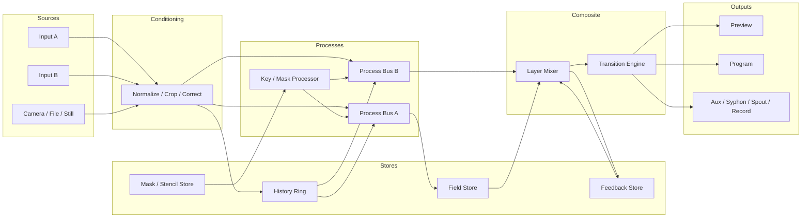

# HUFF Video Instrument Reference Study

**Fairlight CVI / Fairlight Video Entertainer · Snell & Wilcox Magic DaVE · Grass Valley INDIGO AV Mixer**

**Status:** Foundation research memo  
**Purpose:** Preserve the central lessons from these systems before HUFF's post-port architecture, interaction, routing, preset, and automation work begins.  
**Scope:** Historical operating concepts, signal models, interaction design, strengths, weaknesses, and principles that may be adapted to HUFF. This document is not a literal emulation specification and is not yet a source-code audit of HUFF.

---

## 1. Why these systems matter

The Fairlight CVI, Magic DaVE, and Grass Valley INDIGO are important not because they contain a list of vintage effects, but because each turns real-time video into a coherent operating system for performance.

They solve three related but distinct problems:

| System | Primary identity | Central question |
|---|---|---|
| **Fairlight CVI / Video Entertainer** | Computer video instrument, paint system, frame store, and live compositor | What can an image become when live video, stored video, drawing, masks, and time are treated as one material? |
| **Snell & Wilcox Magic DaVE** | Programmable DVE, transition system, and production effects processor | How can an image move through a constructed, repeatable, editable effect? |
| **Grass Valley INDIGO AV Mixer** | Integrated live-production switcher, keyer, converter, audio mixer, and state-recall system | How can a complete live production be routed, previewed, recalled, and operated safely? |

A useful synthesis is:

```text
FAIRLIGHT
image memory + temporal process + mask logic + direct playability

MAGIC DaVE
editable motion + effect objects + transitions + sequences

INDIGO
routing + buses + preview/program + state scope + operational reliability
```

HUFF should not imitate their hardware limitations or copy their interfaces literally. The opportunity is to extract the strongest architectural ideas and reinterpret them for a native Rust + wgpu engine with a flexible HTML control surface.

---

## 2. The preliminary thesis for HUFF

The fixed render pipeline is useful while the native port is being stabilized. It gives every frame a predictable order and makes parity testing possible. After stability is established, however, HUFF should not remain conceptually limited to:

```text
source -> effect 1 -> effect 2 -> effect 3 -> output
```

The three reference systems suggest a richer model:

```text
sources
  -> named buses and image stores
  -> constrained processing paths
  -> masks and keyers that control both display and state updates
  -> compositing and transitions
  -> preview / program / auxiliary outputs
```

The word **constrained** matters. An unrestricted node graph can become difficult to understand, difficult to save, difficult to automate, and easy to break during performance. These machines show that substantial flexibility can be created from a small number of legible buses, planes, memories, keyers, and transitions.

This leads to the central design question for later exploration:

> How can HUFF replace the idea of one fixed pipeline with a constrained routing graph that remains instrument-like, deterministic, debuggable, and safe during live use?

---

# Part I — Fairlight CVI and Fairlight Video Entertainer

## 3. Primary identity

The Fairlight system is the closest philosophical match to HUFF. Fairlight deliberately called the machine a **Computer Video Instrument**. Its control surface combines faders, buttons, a graphics tablet, presets, menus, and a sequencer. It is neither merely a switcher nor merely a paint program.

The machine treats several categories of image as compatible materials:

- incoming live video;
- frozen video held in a field store;
- painted images;
- titles and textures;
- internal stencils;
- live keys derived from incoming video;
- processed digital video;
- the analog video path.

The Video Entertainer manual explicitly describes live video, frozen video, and painted images as different image types that can be combined. A frozen frame can be drawn on, retouched, and recombined with incoming video. Painted images can become foregrounds, backgrounds, titles, shapes, or patterns.

The important lesson is not “add painting to HUFF.” It is:

> Live sources, stored images, masks, and generated material should participate in one coherent image system rather than living in unrelated feature silos.

---

## 4. Fairlight's conceptual image model

The Fairlight documentation describes a system built from interacting image planes and processes. The exact analog/digital implementation belongs to its time, but the conceptual separation is still valuable.

A useful modern interpretation is:

```text
LIVE ANALOG / CLEAN SOURCE
          |
          +-----------------------------+
          |                             |
          v                             v
DIGITAL PROCESSING PATH             FIELD STORE
          |                         frozen / painted /
          |                         repeatedly updated image
          +-------------+---------------+
                        |
                    STENCIL / KEY
                 region ownership logic
                        |
                      OUTPUT
```

The system does not reduce every operation to a single serial effect chain. Instead, the operator decides what image exists in a region, what is stored, what is updated, what is protected, and what is displayed.

### Modern HUFF interpretation

HUFF may eventually need explicit distinctions among:

- **clean input texture** — current decoded or captured frame;
- **processed live texture** — current source after selected live processing;
- **history ring** — immutable recent frames available for temporal sampling;
- **persistent field store** — an image that may be selectively overwritten or transformed;
- **feedback store** — an image that is recursively updated from prior output;
- **still stores** — explicitly captured images;
- **mask/stencil stores** — persistent or live region-control textures;
- **program composite** — final on-air output;
- **preview composite** — prepared state not yet committed.

These are not interchangeable. A clear system should define which operations read and write each type of state.

---

## 5. The stencil is more than a matte

The Fairlight stencil is one of the most important ideas in the entire study.

The stencil defines two regions:

- **Stencil On**
- **Stencil Off**

Each region can display a different picture or process. Inverting the stencil swaps those regions. The stencil itself may be drawn, wiped, generated from patterns, or derived from an external source.

More importantly, the stencil can protect regions of the field store from:

- being overwritten by an incoming freeze;
- being modified by drawing;
- being changed by a repeated update process.

This means the stencil acts simultaneously as:

1. a visibility matte;
2. a source router;
3. a write-enable mask;
4. a protection mask;
5. a region-selection mechanism for temporal processes.

The internal stencil moves with the field-store pixels when the stored image is panned, stretched, or zoomed. This is a strong indication that the stencil is treated as part of the stored image state rather than as an unrelated final overlay.

### Internal and live stencils

Fairlight distinguishes an internal stored stencil from a live key derived from incoming video. A live chroma or luminance key follows the incoming action continuously. The internal stencil and live key can be combined for under/over and multi-plane effects.

### HUFF principle

A future HUFF mask should not be limited to “effect amount” or alpha compositing. A mask could independently control:

```text
DISPLAY MASK
Which source or layer is visible?

PROCESS MASK
Where does an effect apply?

WRITE MASK
Where may a persistent buffer be updated?

PROTECT MASK
Where must existing memory remain untouched?

RESTORE MASK
Where is clean input reintroduced?

ROUTING MASK
Which pixels are sent to an alternate path?
```

A single mask object might provide several of these roles, but the roles should be explicit.

---

## 6. Freeze is a temporal policy, not a Boolean

Fairlight's preset catalogue demonstrates that “freeze” is not one function. It is a family of image-memory update policies.

Its effects include concepts such as:

- single freeze;
- push-to-freeze;
- strobe;
- periodic capture at a controllable rate;
- trails;
- ghost or double-exposure behavior;
- slow scans across or down the image;
- catch-up behavior;
- disintegration from still to live;
- slide-and-store effects;
- trails combined with mirrors, movement, colorization, or keys;
- selective freezing through stencils.

This is a crucial distinction:

```text
A frame store is the memory.
A freeze mode is the policy controlling how that memory changes.
```

### Candidate temporal policies for HUFF

```text
LIVE
Read the current frame without persistent storage.

HOLD
Stop updating the store.

CAPTURE
Replace the store once when triggered.

SAMPLE
Replace the store at a specified interval.

ACCUMULATE
Blend new material into existing memory.

TRAIL
Add or mix new frames while progressively decaying old content.

STROBE
Capture discrete temporal slices.

SCAN
Update only a moving region of the stored image.

CATCH-UP
Progressively replace stored content until it reaches current live state.

PROTECTED UPDATE
Update only pixels permitted by a write mask.

SLIDE / WRAP UPDATE
Transform stored content before the next write.

FEEDBACK
Use a prior composite as input to the next update.
```

This vocabulary is much more expressive than a generic “history amount” slider.

---

## 7. Presets store process state, not pictures

The Fairlight manuals make an essential distinction: a preset contains control information, not pictorial information.

A preset records items such as:

- slider positions;
- push-button states;
- menu selections;
- operating modes;
- the construction of an effect.

When recalled, the same process is applied to whatever source is currently entering the system. The resulting image may therefore be completely different from the photograph used to document the preset.

This gives presets four important qualities:

1. **Source independence** — the process can be reused with new imagery.
2. **Fast recall** — complicated menu conditions can be reached immediately.
3. **Performance safety** — the operator does not need to expose menus during a show.
4. **Editability** — a recalled preset remains a live starting point that can be changed.

### HUFF principle

HUFF should maintain a strict conceptual separation among:

```text
PRESET
A reusable operating condition or partial state.

SNAPSHOT
A complete capture of the current instrument state.

STILL
Stored pixel data.

SEQUENCE
State changes over time.

PROJECT
Presets, sequences, mappings, sources, stores, and configuration.
```

Those terms should not be used interchangeably.

---

## 8. The sequencer records actions and state changes

Fairlight sequences reproduce a series of presets and control-panel moves. They do not store rendered moving images. A sequence can therefore reenact the same operations on whatever video is currently connected.

The original CVI documentation presents a layered path of increasing depth:

1. immediate front-panel controls;
2. factory presets;
3. deeper menus;
4. the sequencer;
5. external computer control;
6. multiple cascaded CVIs.

This progressive-disclosure model is as important as the sequencer itself. The system offers quick success to a beginner without eliminating depth for an expert.

### HUFF principle

HUFF automation should record changes in canonical instrument state, not simulate mouse movement and not capture rendered video.

A useful event model would include:

```text
parameter or action identifier
value or trigger
canonical timestamp
interpolation profile
scope / target bus
source of the event
optional quantization
optional loop behavior
```

The event system should be capable of recording both continuous gestures and discrete actions such as:

- capture frame;
- invert mask;
- recall preset;
- take preview to program;
- clear a store;
- change a routing assignment;
- begin or stop a temporal update policy.

---

## 9. Semantic control groups

The Fairlight surface groups controls by operator meaning rather than by implementation detail. The faders are organized around broad ideas such as:

- color;
- timing;
- movement.

A control may change meaning according to the selected operating mode. For example, movement controls can transform a still image, while related controls can produce mosaic behavior on live digital imagery.

Context-sensitive controls are dangerous when their target is hidden. Fairlight makes them workable because the mode is explicit and the controls remain grouped by understandable intent.

### HUFF principle

Do not expose every WGSL uniform as an equally important unrelated slider.

Organize performance controls by concepts such as:

```text
IMAGE
source, clean/process mix, crop, scale

TIME
capture, age, delay, decay, trail, sample interval

MOVEMENT
pan, zoom, rotate, wrap, drift

REGION
mask, key, stencil, protect, invert

COLOR
hue, saturation, value, remap, posterize

COMPOSITE
layer, under/over, blend, take, transition
```

The technical editor may still expose every parameter. The performance surface should expose coherent operator intent.

---

## 10. Fairlight's greatest strengths

- It treats live imagery, stored imagery, drawing, masks, and temporal processes as one system.
- Its stencil controls both compositing and memory ownership.
- It makes image memory directly playable.
- Presets reproduce processes rather than static pictures.
- Sequences remain source-independent.
- The physical interface provides immediate access while menus provide depth.
- A large effect vocabulary emerges from combinations of a relatively small set of primitives.
- Its design encourages experimentation without abandoning repeatability.

## 11. Fairlight's weaknesses and risks

- Context-sensitive controls can be difficult to understand.
- Hidden interactions among buttons, menus, faders, and image stores can create mode confusion.
- The operator may need to remember what kind of image currently occupies the field store.
- Menus and system overlays can interrupt a clean live output if not managed separately.
- Hardware-era memory and format limits shaped the workflow.
- The preset catalogue is creatively rich but not always organized around a clean conceptual taxonomy.

### What HUFF should avoid copying

- obscure mode combinations with no visible state explanation;
- ambiguous ownership of stored imagery;
- one set of controls silently targeting unrelated parameters;
- menu interactions that contaminate program output;
- preset recall that changes undocumented hidden state.

---

# Part II — Snell & Wilcox Magic DaVE

## 12. Primary identity

Magic DaVE is a programmable digital video effects system with switcher-like program/preset behavior, keying, transitions, trails, still storage, and an extended control panel.

The Version 3 manual describes multiple configurations. The four-input standard system includes:

- four video inputs and one key input;
- a program/preset mix/wipe facility;
- bordered wipes and fade-to-black;
- crop, border, multigrab, lighting, keying, solarization, posterization, mosaic, color effects, lift/gain;
- a 3D DVE with position, size, rotation, perspective, zoom, and a library of models;
- two simultaneous live sources available to many DVE models;
- internal matte and pattern generators.

The option system adds additional live-source processing, a downstream keyer, advanced layer mixing, more wipe patterns, additional DVE models, still storage, sophisticated trail processing, additional keying, ChromaFX, and improved anti-aliasing.

Magic DaVE is less like an open-ended paint instrument than the CVI. Its creative power comes from representing effects as controllable structures that can be stored, sequenced, and recalled.

---

## 13. Effect objects have surfaces and internal structure

Many Magic DaVE effects are not simply shaders applied to a flat image. They are models with meaningful surfaces and geometry.

The documented model families include concepts such as:

- page turns;
- page peels;
- push-on and push-off;
- mix or wipe within the DVE picture;
- drop shadows;
- corner transforms;
- ripples and warps;
- spheres and rounded objects;
- cinema-screen-like forms;
- goblets and related models;
- twin tiles, quad splits, multi-tiles, slabs, and dual images.

Many models can use two live sources simultaneously. This enables front/back or side-by-side source assignment within one effect object.

### HUFF principle

An advanced HUFF effect should eventually be able to declare more than one generic input texture.

A structured effect object might expose:

```text
front source
back source
edge / border source
mask source
lighting parameters
shadow parameters
geometry transform
crop
material / color processing
transition progress
output alpha / key
```

This is different from an unrestricted graph. It is a typed object with known surfaces and known behavior.

---

## 14. The block diagram reveals a layered architecture

The Magic DaVE 8D option-system block diagram is particularly instructive. It separates:

- source selection;
- decoding, keying, and frame synchronization;
- DVE and background source selection;
- matte and pattern generation;
- input processing effects;
- address generation and crop;
- border and lighting;
- the DVE store;
- cut/mix/wipe operations;
- DVE self-keying and ChromaFX;
- an independent trail store;
- downstream keying;
- background selection;
- a layer cut/mix/wipe stage;
- final combining and fade-to-black;
- preview selectors and separate program/preview outputs;
- still capture.

The important lesson is that complex effects emerge from a sequence of typed subsystems. Each subsystem has a comprehensible responsibility.

### HUFF principle

The native renderer may contain many wgpu passes, but the operator-facing model should name the responsibilities, not the passes.

For example:

```text
SOURCE CONDITIONING
synchronization, decode normalization, crop, color correction

IMAGE OBJECT
geometry, front/back assignment, border, lighting

TEMPORAL STORE
history, trail, freeze, persistent image memory

KEY / MASK
self key, external key, stencil, matte

LAYER MIXER
cut, mix, wipe, under/over

OUTPUT
preview, program, auxiliary, capture
```

---

## 15. Sequences and DMEMs are deliberately different

Magic DaVE's state model is more explicit than many modern creative applications.

### Sequence

A sequence is a series of system states called **shots** or **keyframes**. Each keyframe stores its own state plus the speed and transition mode used to reach the next keyframe.

Sequences can be:

- inserted into;
- modified;
- deleted from;
- named;
- stored in nonvolatile memory;
- saved to removable media;
- externally triggered;
- grouped in a sequence cache for rapid recall.

The manual notes a cache of 24 sequences for immediate running or editing.

Crucially, sequence keyframes do **not** store the entire system state. Some setup parameters are intentionally non-sequenceable. This prevents an artistic sequence from unexpectedly overriding calibration or source-correction settings.

### DMEM

A DMEM stores an individual complete state of the machine, including setup parameters. It is closer to a full snapshot than a performance sequence keyframe.

### Files and folders

Sequences, sequence caches, and DMEMs are collectively treated as files. The system supports folders and can store over a thousand such files in nonvolatile memory.

### HUFF principle

HUFF should separate at least four recall objects:

```text
PARTIAL PRESET
Selected artistic parameters only.

SEQUENCE KEYFRAME
A state intended for temporal interpolation; excludes unsafe or non-sequenceable configuration.

FULL SNAPSHOT
Complete instrument state for recovery or project recall.

SYSTEM CONFIGURATION
Devices, formats, mappings, calibration, and output settings.
```

A parameter schema should explicitly declare whether a property is:

- presettable;
- sequenceable;
- interpolatable;
- project-scoped;
- system-scoped;
- unsafe to change live.

---

## 16. Transitions are part of the effect grammar

Magic DaVE integrates ordinary switching and DVE behavior. It supports cut, mix, wipe, fade, program/preset operation, a T-bar, key layers, and DVE transformations.

This suggests that a transition is not merely a decorative effect placed at the end of a pipeline. It is a controlled change from one valid system state to another.

A transition may change:

- source assignment;
- layer visibility;
- geometry;
- mask or key state;
- crop;
- lighting;
- temporal processing;
- background state;
- DVE model parameters.

### HUFF principle

Represent transitions as first-class state transformations:

```text
STATE A
  source A on program
  field store held
  mask inverted
  geometry flat

TRANSITION
  duration
  profile
  affected domains
  interruption behavior

STATE B
  source B on program
  field store updating
  mask normal
  geometry page turn
```

The system should define what happens when a transition is:

- paused;
- reversed;
- interrupted;
- retriggered;
- recalled from the opposite endpoint;
- applied only to selected layers.

---

## 17. Trails are an independent subsystem

Magic DaVE's option system includes a dedicated trail store with multiple trail modes, blur, montage, shadow, sparkle, color controls, and independent processing for video and key portions.

This is a useful reminder that a sophisticated temporal effect deserves its own state and lifecycle. It should not be hidden inside a generic effect pass.

### HUFF principle

Treat persistent temporal systems as resources with explicit properties:

```text
input source
write policy
read policy
buffer format
buffer resolution
mask / key
decay
delay
spatial transform
color transform
clear trigger
health / allocation state
```

This also improves diagnostics. A user should be able to see whether a temporal store is allocated, updating, held, empty, or recovering.

---

## 18. Magic DaVE's greatest strengths

- Complex DVE effects are represented as editable, repeatable structures.
- Many models can use two live sources within one object.
- Geometric motion, keying, trails, lighting, and transitions are integrated.
- Sequences store shots, timing, and transition behavior.
- Sequence state is deliberately narrower than full-machine state.
- DMEMs provide complete recall when needed.
- Files, folders, caches, and nonvolatile memory support production organization.
- Program/preset operation and dedicated controls support rehearsal and safe execution.
- Its block architecture separates responsibilities clearly.

## 19. Magic DaVE's weaknesses and risks

- A large model library can encourage preset browsing instead of conceptual understanding.
- Menu depth can make detailed programming slow.
- Fixed model categories can limit open-ended experimentation.
- Hardware-era processing constraints create special cases among configurations.
- A single control can act on many delegated targets, increasing mode complexity.
- Production terminology and file-management concepts may be heavier than an artist expects.

### What HUFF should avoid copying

- effect categories that are merely lists of unrelated models;
- hidden non-sequenceable parameters with no schema or explanation;
- filesystem organization that feels separate from the creative state model;
- motion programming that requires excessive menu traversal;
- a 3D system so general that it loses the immediacy of a video instrument.

---

# Part III — Grass Valley INDIGO AV Mixer

## 20. Primary identity

The INDIGO AV Mixer combines:

- a video production switcher;
- a seamless computer/video switcher;
- an audio mixer;
- SD and high-resolution conversion;
- keying and digital effects;
- still storage;
- external-device control;
- program, preview, and auxiliary monitoring;
- stored state and interpolated state sequences.

Its value to HUFF is less about aesthetic effects and more about operational architecture.

The system formalizes:

- what is on air;
- what is being prepared;
- which bus a control is targeting;
- which elements participate in the next transition;
- which portions of state are stored;
- how audio follows source selection;
- how outputs are monitored;
- how configuration remains separate from performance.

---

## 21. Buses make routing legible

INDIGO uses named buses and crossbars rather than presenting a raw connection graph.

The important program/preset pattern is:

```text
BACKGROUND BUS
Current on-air background source.

BACKGROUND PRESET BUS
Next background source being prepared.

TRANSITION
Moves selected elements from current to next state.

FLIP-FLOP
After the transition, the buses exchange roles so the Background bus remains on air.
```

The system also delegates source-selection rows to key fills, key signals, and auxiliary outputs.

This gives the operator flexibility without exposing a limitless patching interface.

### HUFF principle

A constrained routing graph should be built from a small number of named destinations. Possible long-term examples include:

```text
INPUT A
INPUT B
CAMERA
FILE
STILL 1..N

CLEAN BUS
Unprocessed normalized source.

PROCESS BUS A
Primary effect path.

PROCESS BUS B
Alternate or preview effect path.

HISTORY BUS
Read-only temporal history source.

FIELD STORE
Persistent selectively updated image.

FEEDBACK BUS
Recursive composite path.

KEY / MASK BUS
Live or stored region control.

AUX BUS 1..N
Independent sends or monitoring paths.

PREVIEW
Prepared composite.

PROGRAM
Committed output.
```

The final names should match HUFF's artistic language, but the responsibilities must remain explicit.

---

## 22. Delegation reduces clutter

INDIGO's control panel uses delegation. The same physical source-selection area or control group can operate different buses depending on which target is selected.

The touch-screen menus and digipots also use automatic menu delegation, allowing the displayed detailed controls to follow the operator's physical selection.

### HUFF principle

Instead of showing every parameter at once, HUFF can use a consistent editor that is delegated to the selected domain:

```text
selected source
selected process bus
selected temporal store
selected mask
selected keyer
selected output
selected automation lane
```

Delegation is successful only when the target is impossible to miss. The interface should always show:

- what is selected;
- what is being controlled;
- whether it is on air;
- whether changes are immediate or staged;
- whether the control affects one bus or a linked group.

---

## 23. Preview and program create a safety boundary

INDIGO separates the current program output from the next state. The operator can prepare a background source, key, or effect and then commit it through CUT, AUTO, or the transition lever.

The **Next Transition** controls determine which elements will change. A transition may affect:

- the background;
- Key 1;
- Key 2;
- multiple selected elements together.

The transition lever can be stopped, reversed, and returned without completing the transition.

### HUFF principle

A future HUFF system could offer two working modes:

```text
DIRECT MODE
Parameter changes affect program immediately.
Best for exploratory instrument performance.

PREVIEW / TAKE MODE
Edits are applied to a staged state.
CUT, AUTO, or a transition control commits selected differences.
Best for deliberate live production.
```

The system should not force every user into broadcast workflow. Preview/Take should be an optional operating mode built on the same canonical state model.

---

## 24. E-MEM provides scoped state recall

INDIGO's E-MEM can store either:

- a preset mixer state;
- a sequence of successive interpolated states.

An E-MEM can include settings for video, audio, effects, and transitions. The system provides 160 memory cells. When learning an E-MEM, the operator can select which setting categories are included.

This selective inclusion is one of the strongest design ideas in the study.

### HUFF principle

Every preset should have a recall scope. For example:

```text
Recall scope:
[x] source assignments
[x] effect parameters
[x] effect enable states
[x] temporal policies
[ ] current pixel contents of stores
[x] routing
[ ] transport position
[ ] output resolution
[ ] device configuration
[x] automation state
```

Selective recall avoids common performance failures:

- an artistic preset unexpectedly changing the source;
- a look preset stopping playback;
- a routing preset changing output resolution;
- a parameter preset clearing temporal memory;
- a transition preset overwriting device configuration.

The scope should be visible, editable, and serializable.

---

## 25. Audio belongs to source ownership and routing

INDIGO supports Audio Follow Video. One or more audio channels can be assigned to a video source. When that video source is selected, the associated audio channels are selected automatically. Separate On Air and Off Air levels can be maintained.

It also incorporates audio delay management so picture and sound remain synchronized through video processing.

### HUFF principle

Even if HUFF does not become a full audio mixer, a source object should eventually be capable of owning:

```text
video frames
audio stream
transport state
timing / timestamps
latency information
audio analysis or FFT data
source health
routing assignments
```

Video source changes should not leave audio, timing, and analysis as unrelated global state.

---

## 26. Performance and configuration are separate layers

INDIGO's immediate panel is optimized for live operation. Deeper menus handle setup, calibration, source format, device assignment, GPIO, external control, and output configuration.

This separation suggests a clear HUFF interface architecture:

```text
PERFORM
Large controls, triggers, macros, source selection, preview/program, transitions.

EDIT
Complete effect parameters and detailed processing controls.

ROUTE
Buses, sends, returns, masks, keyers, feedback, and outputs.

PROGRAM
Presets, snapshots, sequences, automation, recall scope.

CONFIGURE
Devices, formats, mappings, output targets, performance limits, diagnostics.
```

These may be views rather than separate windows, but their responsibilities should not be collapsed into one undifferentiated panel.

---

## 27. INDIGO's greatest strengths

- Named buses make source ownership and routing understandable.
- Program/preset separation allows safe preparation.
- Next-transition selection defines exactly what will change.
- The T-bar creates direct, reversible transition control.
- Delegation reduces panel clutter.
- E-MEM supports both state recall and interpolated sequences.
- Recall categories can be selectively included.
- Audio, video, timing, and source selection are integrated.
- Program, preview, and auxiliary outputs are explicit.
- Configuration and live performance are treated as different tasks.

## 28. INDIGO's weaknesses and risks

- Broadcast terminology can intimidate artists.
- Menu organization can become bureaucratic.
- Fixed hardware topology limits unusual routing.
- Deep operational safety can reduce spontaneity.
- Effects may feel secondary to production workflow.
- A delegated surface can be confusing if selection state is not visually dominant.

### What HUFF should avoid copying

- exposing the full complexity of a broadcast switcher to every user;
- forcing preview/program workflow during exploratory play;
- excessive layers of setup menus;
- fixed bus names that only make sense to television engineers;
- conflating operational reliability with creative restriction.

---

# Part IV — Comparative analysis

## 29. The systems emphasize different forms of state

| State domain | Fairlight CVI | Magic DaVE | INDIGO |
|---|---|---|---|
| **Live source state** | Live input combined with digital/store paths | Multiple synchronized live inputs assigned to DVE surfaces and layers | Sources assigned to named buses |
| **Pixel memory** | Field store, painted/frozen image, stencil plane | DVE store, trail store, still store | Stills store and production frame processing |
| **Mask/key state** | Internal stencil, live chroma/luma key, external/cascaded stencil | DVE keyers, DSK, masks, ChromaFX | Linear/luma/chroma keyers and mattes |
| **Preset state** | Process settings without pictorial information | DMEM for full state; sequence keyframes for partial state | E-MEM with selectable domains |
| **Time state** | Freeze policies, rate controls, sequencer | Shots/keyframes, transition speed/mode, trail store | Transition durations and interpolated E-MEM states |
| **Routing state** | Display selections for stencil on/off regions and cascaded systems | Typed processing stages and layer combiners | Program, preset, key, auxiliary, and monitor buses |
| **Operator safety** | Presets avoid live menu setup | Program/preset, stored sequences, external triggering | Preview/program, next-transition selection, protected memories |

---

## 30. What each system teaches best

### Fairlight teaches image ontology

It asks the software to understand the difference between:

- current live image;
- stored image;
- painted image;
- mask;
- protected region;
- temporal update process.

### Magic DaVE teaches effect ontology

It asks the software to understand the difference between:

- a source;
- a surface;
- a model;
- a keyframe;
- a transition profile;
- a full snapshot;
- a sequenceable property;
- a non-sequenceable property.

### INDIGO teaches operational ontology

It asks the software to understand the difference between:

- current and next source;
- program and preview;
- bus and layer;
- selected and on-air;
- performance state and configuration;
- an immediate cut and a staged transition;
- full state and selectively recalled state.

HUFF needs all three ontologies, but it should present them through a coherent vocabulary rather than three separate historical interfaces.

---

## 31. Shared design principles

Despite their differences, all three systems converge on several principles.

### 31.1 A small number of primitives can generate a large vocabulary

Their most interesting effects are combinations of:

- source assignment;
- storage;
- keying or masking;
- spatial transformation;
- color transformation;
- temporal update;
- layering;
- transition timing.

HUFF should prefer composable primitives over a growing pile of unrelated one-off effects.

### 31.2 State must be nameable

Presets, sequences, DMEMs, E-MEMs, stills, stores, and buses all give state an identity. Unnamed hidden state is difficult to understand and nearly impossible to perform reliably.

### 31.3 The control surface is part of the architecture

The systems were not designed as processors first and interfaces second. Their control models shaped the signal architecture.

HUFF's Rust engine and HTML UI should share one canonical state vocabulary. The UI should not merely send arbitrary values into shaders.

### 31.4 Performance requires controlled commitment

Fast recall, preview, program/preset buses, caches, and dedicated transitions all reduce the chance of accidental output changes.

### 31.5 Memory is an active creative material

Frame stores, still stores, trail stores, and stencils are not implementation details. They are playable resources.

### 31.6 Automation must act on canonical state

All three systems demonstrate forms of repeatable action or interpolated state. Automation should be source-independent and editable.

### 31.7 Scope prevents dangerous recall

Magic DaVE excludes some setup properties from sequences. INDIGO allows recall categories to be selected. HUFF should make state scope a first-class property.

### 31.8 Reliability must be visible

Production hardware assumes that source, memory, output, and control state must be known. HUFF should expose the desired state, actual state, and health of every important subsystem.

---

# Part V — Translation into HUFF principles

## 32. Principles to preserve

1. **Instrument before effect rack.**  
   HUFF should feel like a coherent video instrument, not a scrolling list of shader demonstrations.

2. **Typed state before arbitrary connections.**  
   Sources, stores, masks, buses, composites, and outputs should have explicit roles.

3. **Constrained routing before unlimited patching.**  
   Add meaningful flexibility while preserving predictability and debuggability.

4. **Masks control behavior, not only visibility.**  
   A region may control reads, writes, protection, routing, and restoration.

5. **Temporal stores have policies.**  
   Hold, capture, sample, trail, scan, catch-up, protect, and feedback should be named behaviors.

6. **Presets have recall scope.**  
   Recalling a look should not silently alter unrelated system state.

7. **Sequences use canonical state.**  
   Automation should remain editable, source-independent, and resolution-independent.

8. **Transitions interpolate valid states.**  
   A transition is not merely a final shader; it is a controlled change in selected domains.

9. **Direct and staged performance can coexist.**  
   Direct mode supports improvisation. Preview/Take mode supports deliberate production.

10. **Performance and configuration are separate.**  
    Device setup, format selection, and diagnostics should not compete with live controls.

11. **Memory contents and memory configuration are distinct.**  
    A preset may configure a field store without necessarily saving its pixels.

12. **System health is part of the user interface.**  
    Decoder, source, store, output, and routing failures should never remain invisible.

---

## 33. Candidate state taxonomy for HUFF

This is a working vocabulary, not a final specification.

### Source state

```text
source identity
source type
transport
frame timestamp
source dimensions and format
video/audio relationship
health
```

### Processing state

```text
effect enable
parameters
insertion point
input bus
output bus
mask assignment
latency class
```

### Temporal state

```text
store identity
store pixel contents
update policy
write mask
read offset
transform
clear state
allocation / health
```

### Composite state

```text
layer order
source assignment
key / mask assignment
blend mode
opacity
geometry
```

### Routing state

```text
bus assignments
sends and returns
feedback paths
preview/program selection
auxiliary destinations
```

### Performance state

```text
selected control target
macros
transition position
active preset
active sequence
record/automation status
```

### Configuration state

```text
input devices
output devices
resolution and frame rate
color format
hardware mappings
resource limits
```

### Health state

```text
desired state
actual state
last successful update
error cause
recovery count
fallback state
```

---

## 34. Candidate recall objects

| Object | Intended use | Pixel data included? | Typical scope |
|---|---|---:|---|
| **Look preset** | Reuse an artistic treatment | No | Effects, masks, color, temporal policy configuration |
| **Routing preset** | Reconfigure buses and source paths | No | Buses, sends, key assignments, outputs |
| **Performance preset** | Recall a playable panel state | Usually no | Macros, selected targets, triggers, effect state |
| **Sequence** | Reproduce changes over time | No | Sequenceable parameters and actions |
| **Snapshot** | Restore the whole instrument | Optional | Full canonical state |
| **Still** | Reuse captured image content | Yes | Pixel data plus metadata |
| **Store image** | Save persistent temporal memory | Yes | Field/feedback store contents |
| **Project** | Reopen a complete working environment | References or embeds data | All of the above plus configuration |

---

## 35. Candidate control layers

### Perform

- source A/B selection;
- primary macros;
- field-store triggers;
- feedback amount;
- mask invert/protect;
- preset and sequence recall;
- preview/program controls;
- transition control;
- emergency clear and clean-output actions;
- visible system health.

### Edit

- complete effect parameters;
- mask construction;
- temporal policy details;
- color and geometry details;
- effect-object surface assignment.

### Route

- source-to-bus assignments;
- effect insertion points;
- sends and returns;
- feedback connections;
- key and mask routing;
- auxiliary outputs.

### Program

- preset scope;
- sequence editor;
- automation recording;
- interpolation profiles;
- transition definitions;
- project organization.

### Configure

- input/output formats;
- devices;
- MIDI/OSC/hardware mapping;
- resource limits;
- recording and streaming targets;
- diagnostics.

---

# Part VI — The constrained routing graph: open design seed

## 36. Why not remain fixed?

A permanently fixed chain makes several important historical ideas difficult or impossible:

- processing only selected regions before compositing;
- placing clean video back over feedback;
- sending a mask through a different process than the image;
- maintaining separate field and feedback stores;
- applying an effect before or after a temporal store;
- preparing an alternate state for preview;
- routing one source to several destinations;
- creating intentional feedback loops;
- preserving a clean auxiliary output.

## 37. Why not use a completely open node graph?

A completely open graph can create different problems:

- unclear source ownership;
- accidental cycles;
- nondeterministic resource requirements;
- complex serialization;
- difficult parameter automation;
- poor discoverability;
- live-performance failure modes;
- graphs that are technically valid but artistically incomprehensible;
- increased difficulty reproducing bugs.

The historical machines demonstrate a middle path: fixed categories with flexible assignment.

---

## 38. Proposed high-level routing layers

This diagram is intentionally abstract.



The graph is constrained because:

- node classes are known;
- only approved connection types are valid;
- feedback is allowed only through explicit delay/store nodes;
- outputs have explicit ownership;
- masks use typed mask connections;
- the renderer can validate resource and cycle rules before committing changes.

---

## 39. Candidate graph rules

1. Every render path begins at a valid source or store.
2. Every cycle must pass through a persistent temporal store.
3. A mask connection is typed separately from an image connection.
4. Program output always has one valid composite owner.
5. Preview may differ from program, but both derive from valid complete states.
6. Routing edits are validated before becoming active.
7. A failed route change leaves the last valid graph running.
8. Effects declare input count, output count, format requirements, and latency behavior.
9. Stores declare their write source, write policy, and write mask.
10. Presets declare whether they recall graph topology, parameters, or both.
11. Automation addresses stable object IDs, not screen positions.
12. Graph state and GPU allocation state are separately observable.

---

## 40. Important non-goals

The routing redesign should not automatically mean:

- cloning TouchDesigner, VDMX, Resolume Wire, Notch, or Max;
- turning every shader into a user-visible node;
- allowing arbitrary code execution in the graph;
- exposing GPU resource management to normal performers;
- requiring node editing for ordinary HUFF use;
- removing a fast default signal path;
- sacrificing deterministic export or recording;
- breaking existing presets without a migration strategy.

A strong default instrument should remain usable without opening the routing editor.

---

# Part VII — Research conclusions

## 41. The deepest lesson

The groundbreaking quality of these systems does not come from the age or visual character of their effects. It comes from their ability to make invisible real-time state tangible.

They give the operator understandable handles for:

- where an image comes from;
- where it is stored;
- where it is allowed to change;
- how it moves;
- how it is combined;
- what will happen next;
- what is currently on air;
- what can be recalled;
- what can be sequenced;
- what remains protected.

HUFF's post-port development should aim for the same clarity.

The strongest possible outcome is not “HUFF has more effects.” It is:

> HUFF becomes a coherent native video instrument in which sources, memory, masks, routing, transitions, presets, and automation behave as one understandable system.

---

## 42. Recommended order of future work

This is a conceptual order, not yet an engineering estimate.

1. Finish and stabilize the native port.
2. Audit HUFF's current canonical state and render-resource ownership.
3. Separate clean history, field-store memory, and feedback memory.
4. Define stable IDs and schemas for sources, stores, processes, masks, buses, and outputs.
5. Define preset, snapshot, still, sequence, and project semantics.
6. Add recall scopes and parameter sequenceability metadata.
7. Prototype a small set of named buses over the existing fixed pipeline.
8. Add graph validation and last-known-good fallback behavior.
9. Prototype mask-controlled store writes.
10. Prototype direct mode and preview/take mode over the same state engine.
11. Build canonical automation events and interpolation.
12. Create a dedicated performance surface only after the underlying state model is trustworthy.

---

# Sources and reading map

## Fairlight

- **The Fairlight CVI Computer Video Instrument — Operation Manual, Preliminary Revision 3, September 1984**
  - Introduction and progressive levels of operation: PDF pp. 7-14.
  - Control groups, graphics pad, paint/video menus, presets, sequencer, save/recall: throughout manual.
  - Preset quick-selector images: PDF pp. 2-6.

- **Fairlight Video Entertainer User Manual, 1988**
  - System image types: Getting Started, pp. 5-7; PDF pp. 9-11.
  - Presets store control information rather than pictorial information: Getting Started, pp. 8-9; PDF pp. 12-13.
  - Sequences reproduce stored operations on current input: Getting Started, p. 10; PDF p. 14.
  - Control panel: Getting Started, pp. 4 and 22 onward.

- **Fairlight Computer Video Effects Mixer User Manual, Dealer/Beta edition**
  - Console controls and semantic fader groups: CVI Description pp. 1-2; PDF pp. 3-4.
  - Stencil controls: CVI Description pp. 3-4 and 10-11; PDF pp. 5-6 and 12-13.
  - Preset semantics: CVI Description p. 12; PDF p. 14.
  - Conceptual model and functional overview: early manual sections following the console description.

## Snell & Wilcox

- **Magic DaVE Model 8DOE / 4DE / 4DOE User Manual, Version 3.00, 1998**
  - System configurations and feature sets: Section A, manual p. 4; PDF p. 15.
  - Simplified 8D option-system block diagram: Section A, manual p. 5; PDF p. 16.
  - Mainframe and control panel memory: Section A, manual p. 7; PDF p. 18.
  - Sequences, shots/keyframes, sequence caches, DMEMs, files, and folders: Section A, manual p. 8; PDF p. 19.
  - Control surface operation: Section A, manual pp. 10-29.
  - Models, transforms, keyers, trails, transitions, sequence control, save/recall: Section B.

## Grass Valley

- **INDIGO AV Mixer User Manual, Software Version 1.2.2, August 2007**
  - Product identity and key features: pp. 13-14.
  - Control panel, delegation, buses, transitions, numeric recall, audio, joystick: pp. 37-45.
  - Source selection and video/audio processing: pp. 46-65.
  - Onscreen preview and automatic menu delegation: pp. 73-77.
  - Transition and keyer menus: pp. 77-96.
  - E-MEM state and sequence recall: pp. 107-108.
  - Color correction, mattes, stills, setup, GPIO, external devices, and load/save: pp. 109-146.

---

## Research status note

This memo captures the major architectural and interaction lessons established in the initial research pass. It should be expanded later with:

- detailed feature-by-feature mechanism maps;
- exact parameter/interpolation taxonomies;
- annotated signal-flow diagrams;
- control-surface diagrams;
- HUFF source-code mappings;
- experiments implemented in Junkpile before HUFF integration;
- migration plans for existing HUFF projects and presets.

